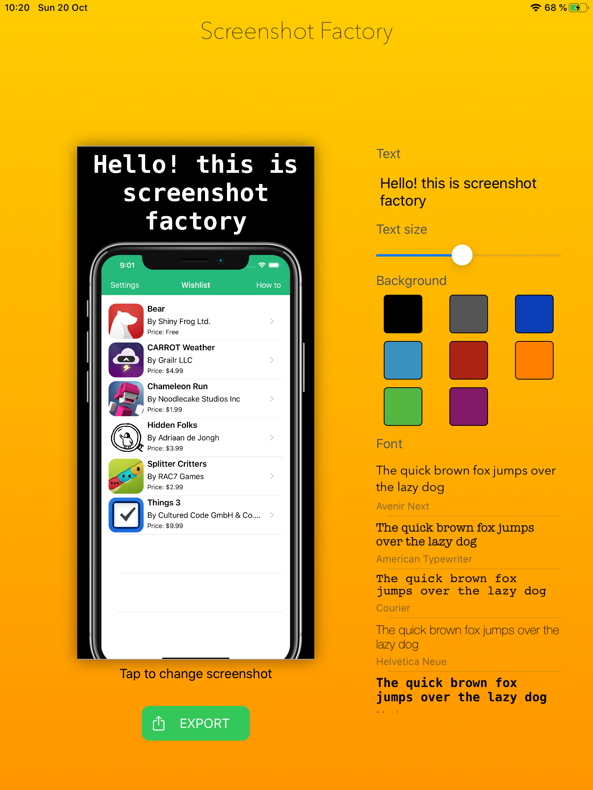

# Screenshot Factory

My toy project to automate creation of these cool AppStore screenshot with iPhone frame and promo text. So you dont have to do it manually or pay for web apps do it for you.

Eventually I would like this to be a macOS app via Catalyst and support variety of iOS devices.

_Feel free to help or offer suggestions._

## Roadmap

* Finalize animations
* "Convert" to Catalyst and add drop support for source screenshots
* Persistence - Maybe the option to create "projects" and have saved screenshots with configurations for each
-- 

### Current progress

